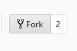

# 
Library for creating GraphQL servers with .NET core.

[](https://travis-ci.org/mkmarek/graphql-dotnetcore)

[](https://coveralls.io/github/mkmarek/graphql-dotnetcore?branch=master)
[](https://www.nuget.org/packages/GraphQLCore/)
[](https://www.myget.org/feed/graphqlcore-ci/package/nuget/GraphQLCore)


## Code Example
```csharp
public class Query : GraphQLObjectType
{
	public Query() : base("Query", "Root query defintion")
	{
		this.Field("sum", (int[] numbers) => numbers.Sum());
	}
}

public class MyAwesomeSchema : GraphQLSchema
{
    public MyAwesomeSchema()
    {
        var rootQuery = new Query();
        this.AddKnownType(rootQuery);
        this.Query(rootQuery);
    }
}

[Route("api/[controller]")]
public class GraphQLController : Controller
{
    private MyAwesomeSchema schema = new MyAwesomeSchema();

    [HttpPost]
    public JsonResult Post(string query)
    {
        return this.Json(
            new
            {
                data = this.schema.Execute(query)
            }
        );
    }
}
```

### Query

```graphql
{
  sum(numbers: [1,2,3])
}
```

### Result

```json
{
  "sum" : 6
}
```
Interested? Have a look on a better example [here](examples/GraphQLCore.GraphiQLExample)!

## Documentation

1. Scalar type translation
2. Nullability
3. [Untyped object definition](docs/untyped-object-definition/overview.md)
	- [Resolvers](docs/untyped-object-definition/overview.md#resolvers)
4. [Typed object definition](docs/typed-object-definition/overview.md)
	- [Accessors](docs/typed-object-definition/overview.md#accessors)
	- [Resolvers](docs/typed-object-definition/overview.md#resolvers)
5. [Interfaces](docs/interfaces/overview.md)
    - [Accessors](docs/interfaces/overview.md#accessors)
6. [Input object definition](docs/input-object-definition/overview.md)
	- [Accessors](docs/input-object-definition/overview.md#accessors)
7. Schema
    - Queries
    - Mutations
    - Subscriptions (TBD)
    - Execution
8. Introspection
9. Validation
10. Roadmap

## Contributions
Wanna contribute? Awesome! Please follow this process to get your feature
or bugfix in place.

### Fork it

### Clone it
```
git clone https://github.com/<your_username>/graphql-dotnetcore.git
cd graphql-dotnetcore
```
### Do it
```
git checkout develop
...
git add -A
git commit -m "Awesome feature"
...
git add -A
git commit -m "Fix awesome feature"
...
git add -A
git commit -m "Fix the previous fix for awesome feature"
...
```
### Squash it
```
git rebase -i <commit>
```
More info about squashing [http://gitready.com/advanced/2009/02/10/squashing-commits-with-rebase.html](http://gitready.com/advanced/2009/02/10/squashing-commits-with-rebase.html).

### Push it
```
git push
```

### Request it
The final step will be creating a pull request. Refer the github docs
for more details about that [https://help.github.com/articles/using-pull-requests/](https://help.github.com/articles/using-pull-requests/)
